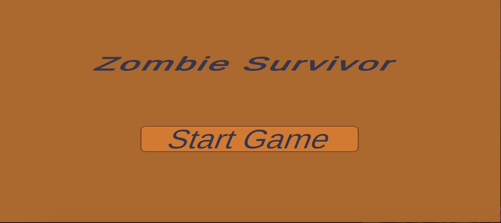
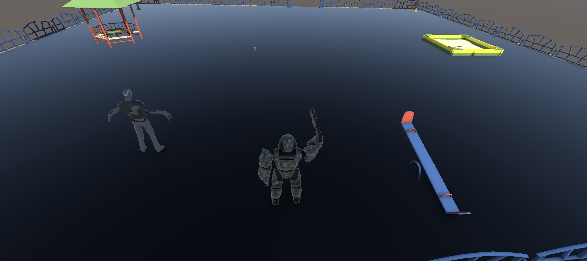
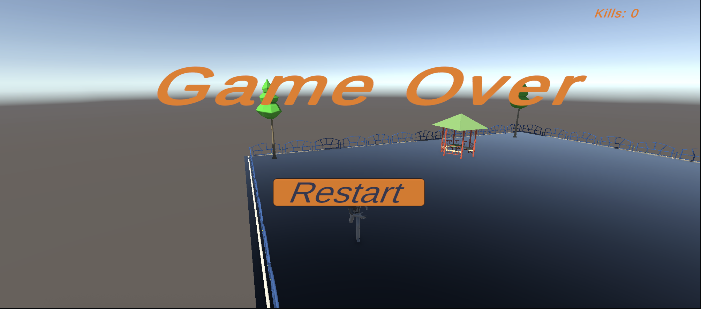

# 🧟 Zombie Survival

A third-person Unity survival game where you fight endless waves of zombies.  
Move, aim, and shoot to earn points — one point per zombie kill.  
If a zombie reaches you, it’s **Game Over** ☠️.

---

## 🎮 Gameplay Preview

| Start Menu | In-Game | Game Over |
|-------------|----------|------------|
|  |  |  |

---

## 🚀 Features

- 👾 **Zombies AI** — chase and face the player.
- 🔫 **Shooting System** — fire bullets with **Left Mouse Click**.
- 💥 **Collisions** — bullets destroy zombies, zombies kill the player.
- 🧮 **Score System** — +1 for each zombie killed.
- 🔊 **Sound Effects** — gunfire sound when shooting.
- 🧩 **Wave Spawning** — increasing challenge with each wave.
- 🕹 **Start & Game Over Panels** — UI flow control.
- 🎥 **Smooth Camera Follow** — third-person camera behind player.

---

## ⚙️ Controls

| Action | Key |
|--------|-----|
| Move Player | **W / A / S / D** |
| Rotate Player | **Move Mouse (Cursor Direction)** |
| Shoot | **Left Mouse Button** |

---
## 🧩 Game Flow

1. **Start Panel** appears when game launches.  
   - Click **Start Game** to begin.
2. **Gameplay** — move and shoot zombies.  
3. **Zombies** die when hit by bullets.  
4. **Player dies** on zombie contact → Game Over Panel appears.  
5. **Restart** button reloads scene directly into gameplay.